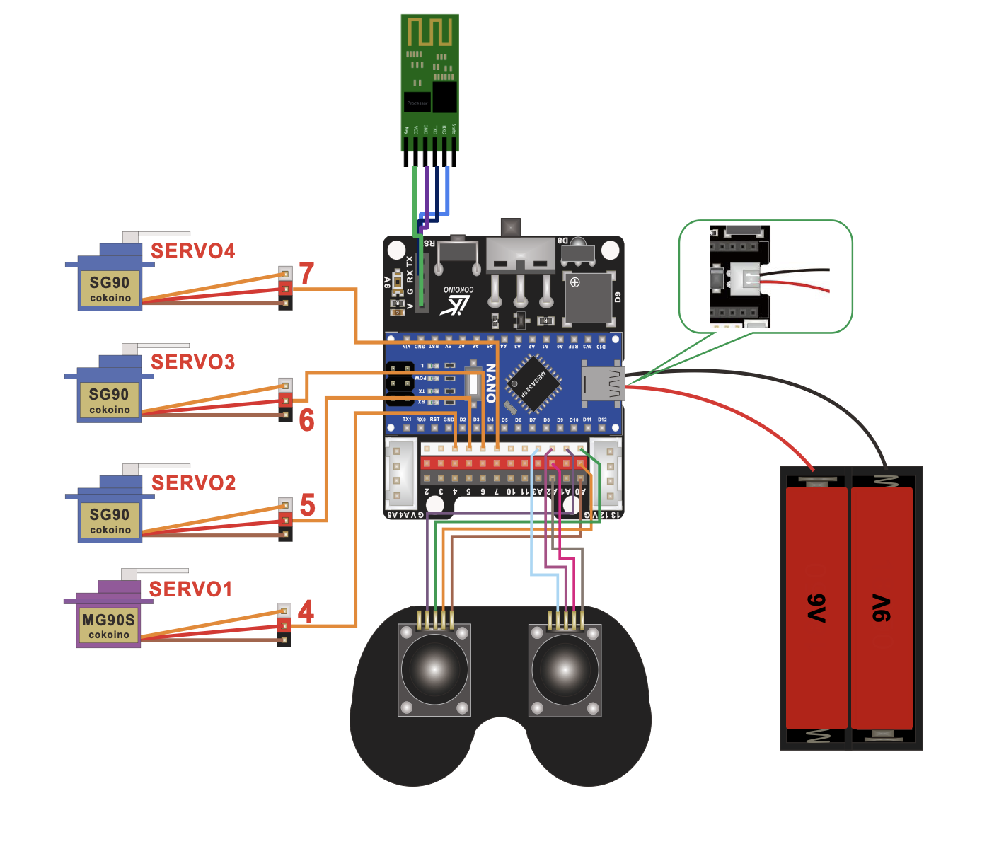
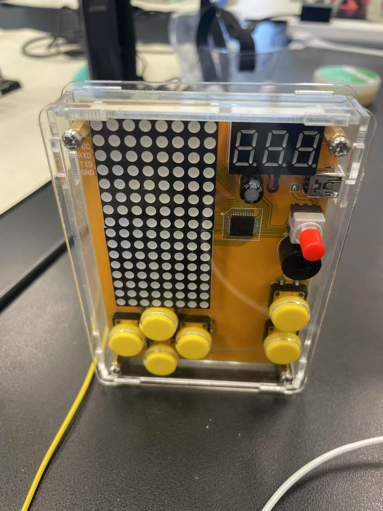

# Phone-Controlled Robotic Arm
This robotic arm has the ability to flex and grab objects around it using the help of the servos at each of its joints. You can control the arm in two ways: the 2-joystick controller or on an app on your phone. 

You should comment out all portions of your portfolio that you have not completed yet, as well as any instructions:


| **Engineer** | **School** | **Area of Interest** | **Grade** |
|:--:|:--:|:--:|:--:|
| Nathan G | valley christian high school | Electrical Engineering | Incoming Senior

**Replace the BlueStamp logo below with an image of yourself and your completed project. Follow the guide [here](https://tomcam.github.io/least-github-pages/adding-images-github-pages-site.html) if you need help.**


  
# Final Milestone

**Don't forget to replace the text below with the embedding for your milestone video. Go to Youtube, click Share -> Embed, and copy and paste the code to replace what's below.**

<iframe width="560" height="315" src="https://www.youtube.com/embed/F7M7imOVGug" title="YouTube video player" frameborder="0" allow="accelerometer; autoplay; clipboard-write; encrypted-media; gyroscope; picture-in-picture; web-share" allowfullscreen></iframe>

For your final milestone, explain the outcome of your project. Key details to include are:
- What you've accomplished since your previous milestone
- What your biggest challenges and triumphs were at BSE
- A summary of key topics you learned about
- What you hope to learn in the future after everything you've learned at BSE


# Second Milestone

**Don't forget to replace the text below with the embedding for your milestone video. Go to Youtube, click Share -> Embed, and copy and paste the code to replace what's below.**

<iframe width="560" height="315" src="https://www.youtube.com/embed/-TGl8HuMn2U?si=Ygdgz4_ftY6ROVnL" title="YouTube video player" frameborder="0" allow="accelerometer; autoplay; clipboard-write; encrypted-media; gyroscope; picture-in-picture; web-share" referrerpolicy="strict-origin-when-cross-origin" allowfullscreen></iframe>

For your second milestone, explain what you've worked on since your previous milestone. You can highlight:
- Technical details of what you've accomplished and how they contribute to the final goal
- What has been surprising about the project so far
- Previous challenges you faced that you overcame
- What needs to be completed before your final milestone 

# First Milestone


<iframe width="560" height="315" src="https://www.youtube.com/embed/TiXjgwiSENg?si=6ddoSbokv7xfIw1o" title="YouTube video player" frameborder="0" allow="accelerometer; autoplay; clipboard-write; encrypted-media; gyroscope; picture-in-picture; web-share" referrerpolicy="strict-origin-when-cross-origin" allowfullscreen></iframe>

## Description
For my main project, my first milestone was to assemble and build the components of my robotic arm, which includes the structure of the arm itself and the 2-joystick controller. I chose this project primarily because of its significance and symbolism in robotics. This project is also the perfect difficulty level as it is not too hard but enough to challenge me in the right areas and expand my skill set. There are three main components to this project: the battery pack, the Arduino Nano board, and the structure of the arm itself. The battery pack is used to power the arm since it cannot function from the power provided by the computer alone. The Arduino Nano board is what facilitates communication between the computer and the arm + controller, which is how the arm is able to read code and able to move specific joints based on commands from the controller. The robotic arm has 4 main points of movement: the turning table on the bottom, the two joints on the arm, and the opening/closing of the claw at the top.

## Challenges
challenges I faced was finding and alternate design solution for my battery pack, since the size of batteries provide is smaller. I cut the connection wire and sodering the wire to the batterie box with the right size. Another challenge I faced was on teasting the servo motors, in the servo test process, all of the blue servo is not working at all enven through the wires is pluged in. But the black servo works well, after I serch on the internet, the blue servo requires sertain votage which is more than the laptop power can provide, after I plug the batteries into the Ardrino Nano board, the servo wors!

## Next Steps
My next steps from here are to code the controller to be able to move certain joints depending on the movement and direction of the individual joystick.

# Schematics 
<!---Here's where you'll put images of your schematics. [Tinkercad](https://www.tinkercad.com/blog/official-guide-to-tinkercad-circuits) and [Fritzing](https://fritzing.org/learning/) are both great resoruces to create professional schematic diagrams, though BSE recommends Tinkercad becuase it can be done easily and for free in the browser. --->

Schematics drawn by [**Cokoino**](https://github.com/Cokoino/CKK0006)



**_Servo/Joycon Wiring Diagram Figure #4_**


# Starter project 



<iframe width="560" height="315" src="https://www.youtube.com/embed/8jSSuW3aXuQ?si=q1MaQJ7DJ7ZseBjN" title="YouTube video player" frameborder="0" allow="accelerometer; autoplay; clipboard-write; encrypted-media; gyroscope; picture-in-picture; web-share" referrerpolicy="strict-origin-when-cross-origin" allowfullscreen></iframe>

## Description

My project is DIY Solder Project Game Kit that have 5 Retro Classic Games for Electronic Soldering Practice and Learning, Comfortable Acrylic Case and Handheld Size, Ideal Gift for Family and Friends by VOGURTIME
My project made up by a board that hold all the electronics and all the electronics, the soldering process make those parts all works well with each other under the good conductivity of the soldering merterial. There are several Power-supply Options – The game kit’s working voltage is DC 3.5-5.5V. It is at the same time handy and nice - After you done the whole kit with quality acrylic case, the kit’s size is 3 x 4.2 x 0.8 inch. You will feel comfortable with rounded acrylic case and big colorful buttons. It looks very nice even it standing there! You can play games with a power bank / 5v power adapter / 3 AAA batteries. The kit includes a 5V USB power cable and a battery case. Install the battery case easily to make it portable. It is really cool that you can also change the brightness and volume. I learned how to soldering with this project. 

## Challenge

In the jounrny of soldering, I faced one challenge, I accidently soldering the part on the board but in the wrong position. which I solved this problem by desoldering. I realized that desoldering is really hard, so in the future soldering projects, I try to becareful all the time. 

## Next step

I am looking forward to complete my robotic arm!


# Code
Here's where you'll put your code. The syntax below places it into a block of code. Follow the guide [here]([url](https://www.markdownguide.org/extended-syntax/)) to learn how to customize it to your project needs. 

```c++
void setup() {
  // put your setup code here, to run once:
  Serial.begin(9600);
  Serial.println("Hello World!");
}

void loop() {
  // put your main code here, to run repeatedly:

}
```

# Bill of Materials
Here's where you'll list the parts in your project. To add more rows, just copy and paste the example rows below.
Don't forget to place the link of where to buy each component inside the quotation marks in the corresponding row after href =. Follow the guide [here]([url](https://www.markdownguide.org/extended-syntax/)) to learn how to customize this to your project needs. 

| **Part** | **Note** | **Price** | **Link** |
|:--:|:--:|:--:|:--:|
| Arduino Nano | Managing and controlling the robot’s components | $24.90 | <a href="https://www.amazon.com/Arduino-A000066-ARDUINO-UNO-R3/dp/B008GRTSV6/"> Link </a> |
| Bluetooth Module | Sending and processing signals between the app and the Arduinor | $7.99 | <a href="https://www.amazon.com/Arduino-A000066-ARDUINO-UNO-R3/dp/B008GRTSV6/"> Link </a> |
| SG90 Servos | Moving the joints and wooden components | $16.95 | <a href="https://www.amazon.com/American-Robotic-Supply-Authentic-Digital/dp/B0783NS32R/ref=sr_1_4?keywords=tower+pro+sg90&qid=1689780732&sr=8-4"> Link </a> |
| MG90 Servo | Moving the base | $10.99 | <a href="https://www.amazon.com/MG90S-Servo-Motor-Helicopter-Arduino/dp/B07L6FZVT1?th=1"> Link </a> |
| Batteries | Powering the Arduino and Bluetooth Module | $6.58 | <a href="https://www.amazon.com/Energizer-Alkaline-General-Purpose-Battery/dp/B00003IE4E?th=1"> Link </a> |
| JST Battery Connectors | Connect the batteries to the circuit’s battery pin | $8.99 | <a href="https://www.amazon.com/daier-Micro-2-Pin-Connector-Female/dp/B01DUC1O68"> Link </a> |
| Battery Clips | Hold the batteries to flow its current into the JST connectors | $5.99 | <a href="https://www.amazon.com/Battery-Connector-I-Type-Plastic-Housing/dp/B07TRKYZCH"> Link </a> |
| Female to Female Connectors | Connecting the Arduino to the wired controller | $6.98 | <a href="https://www.amazon.com/EDGELEC-Breadboard-1pin-1pin-Connector-Multicolored/dp/B07GD312VG/ref=sr_1_4?crid=11X4PIA5EMMZO&keywords=female%2Bto%2Bfemale%2Bconnectors&qid=1689781475&s=industrial&sprefix=female%2Bto%2Bfemale%2Bconnector%2Cindustrial%2C150&sr=1-4&th=1"> Link </a> |
| Joysticks | Allow the user to control the robot using a controller | $9.95 | <a href="https://tinkersphere.com/buttons-switches/922-joystick-breakout-module-arduino-raspberry-pi-compatible.html"> Link </a> |

# Other Resources/Examples
One of the best parts about Github is that you can view how other people set up their own work. Here are some past BSE portfolios that are awesome examples. You can view how they set up their portfolio, and you can view their index.md files to understand how they implemented different portfolio components.
- [Example 1](https://trashytuber.github.io/YimingJiaBlueStamp/)
- [Example 2](https://sviatil0.github.io/Sviatoslav_BSE/)
- [Example 3](https://arneshkumar.github.io/arneshbluestamp/)

To watch the BSE tutorial on how to create a portfolio, click here.
