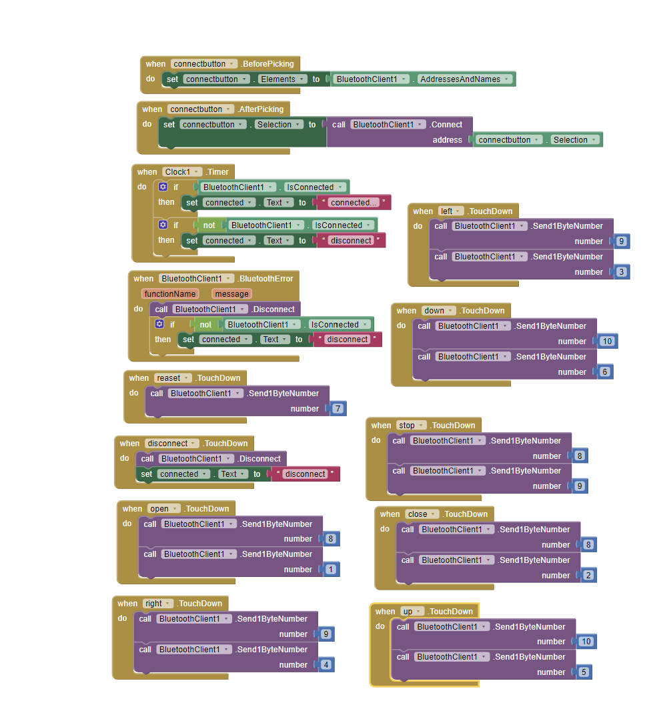

# Phone-Controlled Robotic Arm
This robotic arm has the ability to flex and grab objects around it using the help of the servos at each of its joints. You can control the arm in two ways: the 2-joystick controller or on an app on your phone. 

You should comment out all portions of your portfolio that you have not completed yet, as well as any instructions:


| **Engineer** | **School** | **Area of Interest** | **Grade** |
|:--:|:--:|:--:|:--:|
| Nathan G | valley christian high school | Electrical Engineering | Incoming Senior


# Modification Milestone

### Description
my modification for this project is add wheels to my robotic arm. The app I designed will also contain more buttons for control the move of the robotic arm. so the robotic arm can do more job such as moving object from one location to another location.

### Challenges
There were many challenges during this process. Making sure the best place to put the motor for wheels and wireing. Because the original project toke a lot of avaliable space and pins for wireing, so alot of times modification is hard because it is make change on the things you already have done and worked well. But for the future use, updates should be really common. So I have to try different ways to fit the motor and wheels. 

### Next Steps
My next steps are to make more friends and help others.

  
# Final Milestone

**Don't forget to replace the text below with the embedding for your milestone video. Go to Youtube, click Share -> Embed, and copy and paste the code to replace what's below.**

<iframe width="560" height="315" src="https://www.youtube.com/embed/PvOY1IqD8Ro?si=JoSWD1lWNHYyDWAn" title="YouTube video player" frameborder="0" allow="accelerometer; autoplay; clipboard-write; encrypted-media; gyroscope; picture-in-picture; web-share" referrerpolicy="strict-origin-when-cross-origin" allowfullscreen></iframe>

### Description
my final milestone for this project is design an app on the phone that is able to complete the task include pair with bluetooth and replace the job of joysticks. The app I designed include a lot of different buttons that have the name accroding to its' function such as "up" "down" "left" "open"... when those buttons was touched on the phone, a specific signal was send to the robotic arm, the arm will complete the motion accroding to the information recieved from my phone.

### Challenges
There were many challenges during this process. I try to pair the bluetooth with my phone, however, wrong wiring cause the bluetooth reciver gets into a wrong mode. Because of this, the phone is unable to  connect to the bluetooth reciver wich made it inpossiable to make reliable communication between phone and the robotic arm. To solve this, I serch a lot of instructions about the bluetooth reciver with orders like what to do to switch the mode, how to pair them etc...

### Next Steps
My next steps are to bringstrom and start working on my modifications.

# Arm App Block Code

**_First Block Code Iteration Figure #2_**

# HC-05 test code
sources: https://forum.arduino.cc/t/arduino-to-smartphone-2-way-communication/632304/7
```C++
#include <SoftwareSerial.h>

SoftwareSerial btSerial(10, 11);

void setup()
{
   Serial.begin(9600);
   Serial.println("Bluetooth test program");
   btSerial.begin(9600);
   btSerial.println("Bluetooth test program");
}

void loop(void)
{
  if(Serial.available())
  {
   btSerial.print(char(Serial.read()));
  }
  if(btSerial.available())
  {
   Serial.print(char(btSerial.read()));
  }
}
```
# Arm App Arduino Code
```c++
#include "src/CokoinoArm.h"
#include <SoftwareSerial.h>
#define buzzerPin 9

int screen, state, move, move2, move3;
CokoinoArm arm;
int xL,yL,xR,yR;
SoftwareSerial btSerial(2, 3);
const int act_max=170;   
int act[act_max][4];  
int dataIn[2];
int num=0,num_do=0;

void turnUD(void){
  if(xL!=512){
    if(0<=xL && xL<=100){arm.up(10);return;}
    if(900<xL && xL<=1024){arm.down(10);return;} 
    if(100<xL && xL<=200){arm.up(20);return;}
    if(800<xL && xL<=900){arm.down(20);return;}
    if(200<xL && xL<=300){arm.up(25);return;}
    if(700<xL && xL<=800){arm.down(25);return;}
    if(300<xL && xL<=400){arm.up(30);return;}
    if(600<xL && xL<=700){arm.down(30);return;}
    if(400<xL && xL<=480){arm.up(35);return;}
    if(540<xL && xL<=600){arm.down(35);return;} 
    }
}
void turnLR(void){
  if(yL!=512){
    if(0<=yL && yL<=100){arm.right(0);return;}
    if(900<yL && yL<=1024){arm.left(0);return;}  
    if(100<yL && yL<=200){arm.right(5);return;}
    if(800<yL && yL<=900){arm.left(5);return;}
    if(200<yL && yL<=300){arm.right(10);return;}
    if(700<yL && yL<=800){arm.left(10);return;}
    if(300<yL && yL<=400){arm.right(15);return;}
    if(600<yL && yL<=700){arm.left(15);return;}
    if(400<yL && yL<=480){arm.right(20);return;}
    if(540<yL && yL<=600){arm.left(20);return;}
  }
}
void turnCO(void){
  if(arm.servo4.read()>7){
    if(0<=xR && xR<=100){arm.close(0);return;}
    if(900<xR && xR<=1024){arm.open(0);return;} 
    if(100<xR && xR<=200){arm.close(5);return;}
    if(800<xR && xR<=900){arm.open(5);return;}
    if(200<xR && xR<=300){arm.close(10);return;}
    if(700<xR && xR<=800){arm.open(10);return;}
    if(300<xR && xR<=400){arm.close(15);return;}
    if(600<xR && xR<=700){arm.open(15);return;}
    if(400<xR && xR<=480){arm.close(20);return;}
    if(540<xR && xR<=600){arm.open(20);return;} 
    }
  else{arm.servo4.write(8);

  }  
}

void date_processing(int *x,int *y){
  if(abs(512-*x)>abs(512-*y))
    {*y = 512;}
  else
    {*x = 512;}
}

void buzzer(int H,int L){
  while(yR<420){
    digitalWrite(buzzerPin,HIGH);
    delayMicroseconds(H);
    digitalWrite(buzzerPin,LOW);
    delayMicroseconds(L);
    yR = arm.JoyStickR.read_y();
    }
  while(yR>600){
    digitalWrite(buzzerPin,HIGH);
    delayMicroseconds(H);
    digitalWrite(buzzerPin,LOW);
    delayMicroseconds(L);
    yR = arm.JoyStickR.read_y();
    }
}

void C_action(void){
  if(yR>800){
    int *p;
    p=arm.captureAction();
    for(char i=0;i<4;i++){
    act[num][i]=*p;
    p=p+1;     
    }
    num++;
    num_do=num;
    if(num>=act_max){
      num=0;
      buzzer(600,400);
      }
    while(yR>600){yR = arm.JoyStickR.read_y();}
    //Serial.println(act[0][0]);
  }
}

void Do_action(void){
  if(yR<220) {
    buzzer(200,300);
    for(int i=0;i<num_do;i++) {
      arm.do_action(act[i],15);
    }
    num=0;
    while (yR<420) {
      yR = arm.JoyStickR.read_y();
    }
    for(int i=0;i<2000;i++){
      digitalWrite(buzzerPin,HIGH);
      delayMicroseconds(200);
      digitalWrite(buzzerPin,LOW);
      delayMicroseconds(300);        
    }
  }
}

void setup() {
  Serial.begin(9600);
  btSerial.begin(9600);
  arm.ServoAttach(4,5,6,7);
  arm.JoyStickAttach(A0,A1,A2,A3);
  pinMode(buzzerPin,OUTPUT);
  arm.servo1.write(90);
  arm.servo2.write(90);
  arm.servo3.write(90);
  arm.servo4.write(90);
}

int val, cnt = 0;
int v[2];
void readBT() {
  val = btSerial.read();
  cnt++;
  v[cnt] = val;
  if (cnt == 2) {
    cnt = 0;
  }
}

int in_byte, array_index;
void loop() {

  if (btSerial.available() > 1) {  
  in_byte = btSerial.read(); 
  //Serial.println(in_byte);

  if (in_byte == 0) {
    array_index = 0;
  }

  if (in_byte == 7 || in_byte == 8 || in_byte == 9 || in_byte == 10) {
    array_index = 1;
    state = in_byte;
    move = btSerial.read();
    Serial.println(state);
  } else {
    array_index = 2;
  }

  dataIn[array_index] = in_byte;
  //Serial.println(dataIn[2]);
  //state = dataIn[1];
  //array_index = array_index +1;
}

  if (state == 8) {
    //move = dataIn[2];
  

    //dataIn[1] = move;
    //Serial.println(move);
    if(move == 1) {
      arm.open(30); return;   
    }

    if(move == 2) {
      arm.close(30); return;
    }
  }

  if (state == 9) {
    //move2 = dataIn[2];


    if(move == 3) {
      arm.left(30); return;
    }
    if(move == 4) {
      arm.right(30); return;
    }
  }
  if (state == 10) {
    //move3 = dataIn[2];
   
    //arm.servo4.write(90);
    if(move == 5) {
      arm.down(30); return;
    }
    if(move == 6) {
      arm.up(30); return;
    }
  }
  if(state == 7) {
    arm.servo1.write(90);
    arm.servo2.write(90);
    arm.servo3.write(90);
    arm.servo4.write(90);
  }
  if(arm.servo4.read() < 7) {
    arm.servo4.write(8);
  }
  //Serial.println(state);
}

```

# Second Milestone


<iframe width="560" height="315" src="https://www.youtube.com/embed/-TGl8HuMn2U?si=Ygdgz4_ftY6ROVnL" title="YouTube video player" frameborder="0" allow="accelerometer; autoplay; clipboard-write; encrypted-media; gyroscope; picture-in-picture; web-share" referrerpolicy="strict-origin-when-cross-origin" allowfullscreen></iframe>

## Description
For my main project, my second milestone was to code my robotic arm, which the 2-joystick controller can be able to control the structure. Using code functions from the Servo library, the joysticks is able to control the movement of the servos angles and set it to a specific rotation point based on how much the joystick is pushed forward/backwards. The servo wires that are connected to the Arduino help the computer read which servo should be moved according to which joystick is moved. The battery ensures that enough voltage is moving through the entire circuit so the robotic arm has enough energy to move freely without having problems
## Challenges
The challenge in this process is that I find the code does not run well in my computer so I have to find an altinate plan to replace the original library. By using the instruction on the internet, the new code works much better. another problem is that the servo test code initially doesn't work so I can not move on to the next step, by checking the schematics one more time, I realized that the servo pluged in the wrong pin, after ajust the test code, the servo do works well. 
## Next Steps
My next steps are to design a app which will also be able to control the robotic arm and make sure bluetooth pair the phone in the right way.

# Arm Code with Joystick control
```C++

#include "src/CokoinoArm.h"
#define buzzerPin 9

CokoinoArm arm;
int xL,yL,xR,yR;

const int act_max=170;    //Default 10 action,4 the Angle of servo
int act[act_max][4];    //Only can change the number of action
int num=0,num_do=0;
///////////////////////////////////////////////////////////////
void turnUD(void){
  if(xL!=512){
    if(0<=xL && xL<=100){arm.up(10);return;}
    if(900<xL && xL<=1024){arm.down(10);return;} 
    if(100<xL && xL<=200){arm.up(20);return;}
    if(800<xL && xL<=900){arm.down(20);return;}
    if(200<xL && xL<=300){arm.up(25);return;}
    if(700<xL && xL<=800){arm.down(25);return;}
    if(300<xL && xL<=400){arm.up(30);return;}
    if(600<xL && xL<=700){arm.down(30);return;}
    if(400<xL && xL<=480){arm.up(35);return;}
    if(540<xL && xL<=600){arm.down(35);return;} 
    }
}
///////////////////////////////////////////////////////////////
void turnLR(void){
  if(yL!=512){
    if(0<=yL && yL<=100){arm.right(0);return;}
    if(900<yL && yL<=1024){arm.left(0);return;}  
    if(100<yL && yL<=200){arm.right(5);return;}
    if(800<yL && yL<=900){arm.left(5);return;}
    if(200<yL && yL<=300){arm.right(10);return;}
    if(700<yL && yL<=800){arm.left(10);return;}
    if(300<yL && yL<=400){arm.right(15);return;}
    if(600<yL && yL<=700){arm.left(15);return;}
    if(400<yL && yL<=480){arm.right(20);return;}
    if(540<yL && yL<=600){arm.left(20);return;}
  }
}
///////////////////////////////////////////////////////////////
void turnCO(void){
  if(xR!=512){
    if(0<=xR && xR<=100){arm.close(0);return;}
    if(900<xR && xR<=1024){arm.open(0);return;} 
    if(100<xR && xR<=200){arm.close(5);return;}
    if(800<xR && xR<=900){arm.open(5);return;}
    if(200<xR && xR<=300){arm.close(10);return;}
    if(700<xR && xR<=800){arm.open(10);return;}
    if(300<xR && xR<=400){arm.close(15);return;}
    if(600<xR && xR<=700){arm.open(15);return;}
    if(400<xR && xR<=480){arm.close(20);return;}
    if(540<xR && xR<=600){arm.open(20);return;} 
    }
}
///////////////////////////////////////////////////////////////
void date_processing(int *x,int *y){
  if(abs(512-*x)>abs(512-*y))
    {*y = 512;}
  else
    {*x = 512;}
}
///////////////////////////////////////////////////////////////
void buzzer(int H,int L){
  while(yR<420){
    digitalWrite(buzzerPin,HIGH);
    delayMicroseconds(H);
    digitalWrite(buzzerPin,LOW);
    delayMicroseconds(L);
    yR = arm.JoyStickR.read_y();
    }
  while(yR>600){
    digitalWrite(buzzerPin,HIGH);
    delayMicroseconds(H);
    digitalWrite(buzzerPin,LOW);
    delayMicroseconds(L);
    yR = arm.JoyStickR.read_y();
    }
}
///////////////////////////////////////////////////////////////
void C_action(void){
  if(yR>800){
    int *p;
    p=arm.captureAction();
    for(char i=0;i<4;i++){
    act[num][i]=*p;
    p=p+1;     
    }
    num++;
    num_do=num;
    if(num>=act_max){
      num=0;
      buzzer(600,400);
      }
    while(yR>600){yR = arm.JoyStickR.read_y();}
    //Serial.println(act[0][0]);
  }
}
///////////////////////////////////////////////////////////////
void Do_action(void){
  if(yR<220){
    buzzer(200,300);
    for(int i=0;i<num_do;i++){
      arm.do_action(act[i],15);
      }
    num=0;
    while(yR<420){yR = arm.JoyStickR.read_y();}
    for(int i=0;i<2000;i++){
      digitalWrite(buzzerPin,HIGH);
      delayMicroseconds(200);
      digitalWrite(buzzerPin,LOW);
      delayMicroseconds(300);        
    }
  }
}
///////////////////////////////////////////////////////////////
void setup() {
  //Serial.begin(9600);
  //arm of servo motor connection pins
  arm.ServoAttach(4,5,6,7);
  //arm of joy stick connection pins : xL,yL,xR,yR
  arm.JoyStickAttach(A0,A1,A2,A3);
  pinMode(buzzerPin,OUTPUT);
}
///////////////////////////////////////////////////////////////
void loop() {
  xL = arm.JoyStickL.read_x();
  yL = arm.JoyStickL.read_y();
  xR = arm.JoyStickR.read_x();
  yR = arm.JoyStickR.read_y();
  date_processing(&xL,&yL);
  date_processing(&xR,&yR);
  turnUD();
  turnLR();
  turnCO();
  C_action();
  Do_action();
}
```

# Joystick test Code


```c++

void setup() { 
pinMode(3, INPUT); 
Serial.begin(9600); 
} 
void loop(){
int value = 0; 
value = analogRead(A0); 
Serial.print("X:"); 
Serial.print(value, DEC); 
value = analogRead(A1); 
Serial.print(" | Y:"); 
Serial.print(value, DEC); 
value = digitalRead(3); 
Serial.print(" | Z: "); 
Serial.println(value, DEC); 
delay(100); 
}
```

# First Milestone

<iframe width="560" height="315" src="https://www.youtube.com/embed/TiXjgwiSENg?si=6ddoSbokv7xfIw1o" title="YouTube video player" frameborder="0" allow="accelerometer; autoplay; clipboard-write; encrypted-media; gyroscope; picture-in-picture; web-share" referrerpolicy="strict-origin-when-cross-origin" allowfullscreen></iframe>

## Description
For my main project, my first milestone was to assemble and build the components of my robotic arm, which includes the structure of the arm itself and the 2-joystick controller. I chose this project primarily because of its significance and symbolism in robotics. This project is also the perfect difficulty level as it is not too hard but enough to challenge me in the right areas and expand my skill set. There are three main components to this project: the battery pack, the Arduino Nano board, and the structure of the arm itself. The battery pack is used to power the arm since it cannot function from the power provided by the computer alone. The Arduino Nano board is what facilitates communication between the computer and the arm + controller, which is how the arm is able to read code and able to move specific joints based on commands from the controller. The robotic arm has 4 main points of movement: the turning table on the bottom, the two joints on the arm, and the opening/closing of the claw at the top.

## Challenges
challenges I faced was finding and alternate design solution for my battery pack, since the size of batteries provide is smaller. I cut the connection wire and sodering the wire to the batterie box with the right size. Another challenge I faced was on teasting the servo motors, in the servo test process, all of the blue servo is not working at all enven through the wires is pluged in. But the black servo works well, after I serch on the internet, the blue servo requires sertain votage which is more than the laptop power can provide, after I plug the batteries into the Ardrino Nano board, the servo wors!

## Next Steps
My next steps from here are to code the controller to be able to move certain joints depending on the movement and direction of the individual joystick.

# Schematics 
<!---Here's where you'll put images of your schematics. [Tinkercad](https://www.tinkercad.com/blog/official-guide-to-tinkercad-circuits) and [Fritzing](https://fritzing.org/learning/) are both great resoruces to create professional schematic diagrams, though BSE recommends Tinkercad becuase it can be done easily and for free in the browser. --->

Schematics drawn by [**Cokoino**](https://github.com/Cokoino/CKK0006)


**_Servo/Joycon Wiring Diagram Figure #4_**


# Starter project 


<iframe width="560" height="315" src="https://www.youtube.com/embed/8jSSuW3aXuQ?si=q1MaQJ7DJ7ZseBjN" title="YouTube video player" frameborder="0" allow="accelerometer; autoplay; clipboard-write; encrypted-media; gyroscope; picture-in-picture; web-share" referrerpolicy="strict-origin-when-cross-origin" allowfullscreen></iframe>

## Description

My project is DIY Solder Project Game Kit that have 5 Retro Classic Games for Electronic Soldering Practice and Learning, Comfortable Acrylic Case and Handheld Size, Ideal Gift for Family and Friends by VOGURTIME
My project made up by a board that hold all the electronics and all the electronics, the soldering process make those parts all works well with each other under the good conductivity of the soldering merterial. There are several Power-supply Options – The game kit’s working voltage is DC 3.5-5.5V. It is at the same time handy and nice - After you done the whole kit with quality acrylic case, the kit’s size is 3 x 4.2 x 0.8 inch. You will feel comfortable with rounded acrylic case and big colorful buttons. It looks very nice even it standing there! You can play games with a power bank / 5v power adapter / 3 AAA batteries. The kit includes a 5V USB power cable and a battery case. Install the battery case easily to make it portable. It is really cool that you can also change the brightness and volume. I learned how to soldering with this project. 

## Challenge

In the jounrny of soldering, I faced one challenge, I accidently soldering the part on the board but in the wrong position. which I solved this problem by desoldering. I realized that desoldering is really hard, so in the future soldering projects, I try to becareful all the time. 

## Next step

I am looking forward to complete my robotic arm!


# Bill of Materials
Here's where you'll list the parts in your project. To add more rows, just copy and paste the example rows below.
Don't forget to place the link of where to buy each component inside the quotation marks in the corresponding row after href =. Follow the guide [here]([url](https://www.markdownguide.org/extended-syntax/)) to learn how to customize this to your project needs. 

| **Part** | **Note** | **Price** | **Link** |
|:--:|:--:|:--:|:--:|
| Arduino Nano | Managing and controlling the robot’s components | $24.90 | <a href="https://www.amazon.com/Arduino-A000066-ARDUINO-UNO-R3/dp/B008GRTSV6/"> Link </a> |
| Bluetooth Module | Sending and processing signals between the app and the Arduinor | $7.99 | <a href="https://www.amazon.com/Arduino-A000066-ARDUINO-UNO-R3/dp/B008GRTSV6/"> Link </a> |
| SG90 Servos | Moving the joints and wooden components | $16.95 | <a href="https://www.amazon.com/American-Robotic-Supply-Authentic-Digital/dp/B0783NS32R/ref=sr_1_4?keywords=tower+pro+sg90&qid=1689780732&sr=8-4"> Link </a> |
| MG90 Servo | Moving the base | $10.99 | <a href="https://www.amazon.com/MG90S-Servo-Motor-Helicopter-Arduino/dp/B07L6FZVT1?th=1"> Link </a> |
| Batteries | Powering the Arduino and Bluetooth Module | $6.58 | <a href="https://www.amazon.com/Energizer-Alkaline-General-Purpose-Battery/dp/B00003IE4E?th=1"> Link </a> |
| JST Battery Connectors | Connect the batteries to the circuit’s battery pin | $8.99 | <a href="https://www.amazon.com/daier-Micro-2-Pin-Connector-Female/dp/B01DUC1O68"> Link </a> |
| Battery Clips | Hold the batteries to flow its current into the JST connectors | $5.99 | <a href="https://www.amazon.com/Battery-Connector-I-Type-Plastic-Housing/dp/B07TRKYZCH"> Link </a> |
| Female to Female Connectors | Connecting the Arduino to the wired controller | $6.98 | <a href="https://www.amazon.com/EDGELEC-Breadboard-1pin-1pin-Connector-Multicolored/dp/B07GD312VG/ref=sr_1_4?crid=11X4PIA5EMMZO&keywords=female%2Bto%2Bfemale%2Bconnectors&qid=1689781475&s=industrial&sprefix=female%2Bto%2Bfemale%2Bconnector%2Cindustrial%2C150&sr=1-4&th=1"> Link </a> |
| Joysticks | Allow the user to control the robot using a controller | $9.95 | <a href="https://tinkersphere.com/buttons-switches/922-joystick-breakout-module-arduino-raspberry-pi-compatible.html"> Link </a> |


