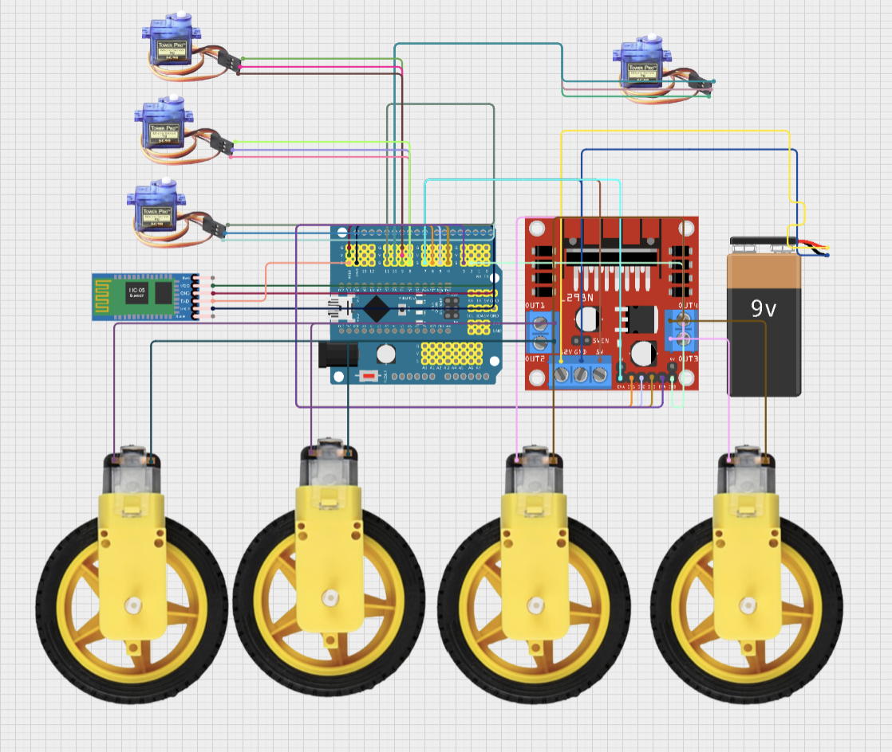

# Phone-Controlled Robotic Arm
This robotic arm has the ability to flex and grab objects around it using the help of the servos at each of its joints. You can control the arm in two ways: the 2-joystick controller or on an app on your phone. 


| **Engineer** | **School** | **Area of Interest** | **Grade** |
|:--:|:--:|:--:|:--:|
| Nathan G | valley christian high school | Electrical Engineering | Incoming Senior


.heic)

# Modification Milestone

### Description
My modification for this project is to add wheels to the robotic arm.
The app I designed will also include more buttons to control the movement of the robotic arm, allowing it to perform additional tasks, such as moving objects from one location to another.
I will use an H-bridge in my modification to drive the motors.
An H-bridge is an electronic circuit that switches the polarity of voltage applied to a load. These circuits are commonly used in robotics and other applications to allow DC motors to run forwards or backwards. The name comes from its typical schematic diagram, which resembles the letter "H" — with four switching elements forming the sides and the load connected across the center.


### Challenges
There were many challenges during this process, such as determining the best location for the motor and wiring for the wheels. The original project took up a lot of available space and pins for wiring, so modifications were often difficult because it required changing things that had already been done and worked well. However, for future updates, planning is crucial. I had to try different methods to fit the motor and wheels properly.
At the same time, the three-wheel system didn’t work well in combination with the robotic arm. The main issue was that three wheels were not enough to balance the robotic arm. As a result, when I commanded the car to move forward, it didn’t go in a straight line. What I did was ask Vrinda to buy an extra wheel for me. After the new wheel arrived and was added to the original base, the balance issue was resolved.
### Next Steps
My next steps are to make more friends and help others.

# Schematics 
the final schematics with motor and arm parts combined.

# Arm App Arduino Code
```c++
#include "src/CokoinoArm.h"
#include <SoftwareSerial.h>

// Pin assignments for motor control
int enA = A0;   // Enable pin for motor A
int in1 = A1;    // Direction pin for motor A
int in2 = A2;    // Direction pin for motor A
int in3 = A3;    // Direction pin for motor B
int in4 = 11;    // Direction pin for motor B
int enB = 10;    // Enable pin for motor B

// Variables to store joystick or state commands
int screen, state, move, move2, move3;lk4
CokoinoArm arm;  // Object for controlling the robotic arm

// Bluetooth serial communication
SoftwareSerial btSerial(2, 3);  // RX, TX for Bluetooth
const int act_max = 170;        // Maximum actions that can be recorded
int act[act_max][4];            // Array to store actions
int dataIn[2];                  // Array for incoming data from Bluetooth
int num = 0, num_do = 0;        // Counters for action tracking

// Function to drive the robot forward
void driveforward() {
  digitalWrite(in1, HIGH);  // Motor A forward
  digitalWrite(in2, LOW);   // Motor A forward
  digitalWrite(enA, 16);    // Enable motor A with a specific speed
  digitalWrite(in3, LOW);   // Motor B forward
  digitalWrite(in4, HIGH);  // Motor B forward
  digitalWrite(enB, 16);    // Enable motor B with a specific speed
}

// Function to drive the robot backward
void drivebackward() {
  digitalWrite(in1, LOW);   // Motor A backward
  digitalWrite(in2, HIGH);  // Motor A backward
  digitalWrite(enA, 16);    // Enable motor A with a specific speed
  digitalWrite(in3, HIGH);  // Motor B backward
  digitalWrite(in4, LOW);   // Motor B backward
  digitalWrite(enB, 16);    // Enable motor B with a specific speed
}

// Function to turn the robot right
void turnright() {
  digitalWrite(in1, HIGH);  // Motor A forward
  digitalWrite(in2, LOW);   // Motor A forward
  digitalWrite(enA, 14);    // Enable motor A with a slower speed
  digitalWrite(in3, HIGH);  // Motor B backward
  digitalWrite(in4, LOW);   // Motor B backward
  digitalWrite(enB, 14);    // Enable motor B with a slower speed
}

// Function to turn the robot left
void turnleft() {
  digitalWrite(in1, LOW);   // Motor A backward
  digitalWrite(in2, HIGH);  // Motor A backward
  digitalWrite(enA, 14);    // Enable motor A with a slower speed
  digitalWrite(in3, LOW);   // Motor B forward
  digitalWrite(in4, HIGH);  // Motor B forward
  digitalWrite(enB, 14);    // Enable motor B with a slower speed
}

// Setup function to initialize communication and hardware
void setup() {
  Serial.begin(9600);                // Start serial communication for debugging
  btSerial.begin(9600);              // Start Bluetooth serial communication

  arm.ServoAttach(4, 5, 6, 7);       // Attach servos to the specified pins for the robotic arm

  // Initialize arm servos to the neutral (middle) position
  arm.servo1.write(90);
  arm.servo2.write(90);
  arm.servo3.write(90);
  arm.servo4.write(90);

  // Initialize motor control pins as outputs
  pinMode(enA, OUTPUT);
  pinMode(in1, OUTPUT);
  pinMode(in2, OUTPUT);
  pinMode(in3, OUTPUT);
  pinMode(in4, OUTPUT);
  pinMode(enB, OUTPUT);
}

// Bluetooth data reading function
int in_byte, array_index;
void loop() {
  if (btSerial.available() > 1) {  // Check if Bluetooth data is available
    in_byte = btSerial.read();     // Read a byte of data from Bluetooth

    if (in_byte == 0) {             // If the byte is 0, reset the array index
      array_index = 0;
    }

    // If the byte is a command state (7 to 13), assign the state and read the move value
    if (in_byte == 7 || in_byte == 8 || in_byte == 9 || in_byte == 10 || in_byte == 11 || in_byte == 12 || in_byte == 13) {
      array_index = 1;            // Set array index to 1 for state data
      state = in_byte;            // Store the state
      move = btSerial.read();     // Read the move command
    } else {
      array_index = 2;            // Set array index to 2 for other data
    }

    dataIn[array_index] = in_byte;   // Store the incoming data in the array
  }

  // Execute actions based on the state and move commands received from Bluetooth

  if (state == 8) {  // Gripper control commands (open/close)
    if (move == 1) {
      arm.open(30);   // Open gripper with 30 movement
      return;
    }
    if (move == 2) {
      arm.close(30);  // Close gripper with 30 movement
      return;
    }
  }

  if (state == 9) {  // Arm left/right movement
    if (move == 3) {
      arm.left(30);   // Move arm to the left
    }
    if (move == 4) {
      arm.right(30);  // Move arm to the right
    }
  }

  if (state == 10) {  // Arm up/down movement
    if (move == 5) {
      arm.down(30);   // Move arm down
    }
    if (move == 6) {
      arm.up(30);     // Move arm up
    }
  }

  if (state == 11) {  // Robot movement (forward/backward)
    if (move == 1) {
      driveforward();  // Move robot forward
    }
    if (move == 2) {
      drivebackward(); // Move robot backward
    }
  }

  if (state == 12) {  // Robot turning (left/right)
    if (move == 4) {
      turnright();     // Turn robot right
    }
    if (move == 3) {
      turnleft();      // Turn robot left
    }
  }

  if (state == 13) {  // Stop all motors
    digitalWrite(in1, LOW);
    digitalWrite(in2, LOW);
    digitalWrite(enA, 225);
    digitalWrite(in3, LOW);
    digitalWrite(in4, LOW);
    digitalWrite(enB, 225);
  }

  // Reset all servos to the neutral position when state is 7
  if (state == 7) {
    arm.servo1.write(90);
    arm.servo2.write(90);
    arm.servo3.write(90);
    arm.servo4.write(90);
  }

  // Ensure servo4 is in a safe state
  if (arm.servo4.read() < 7) {
    arm.servo4.write(8);  // Reset servo4 position to a safe value
  }
}


```
  
# Final Milestone


<iframe width="560" height="315" src="https://www.youtube.com/embed/PvOY1IqD8Ro?si=JoSWD1lWNHYyDWAn" title="YouTube video player" frameborder="0" allow="accelerometer; autoplay; clipboard-write; encrypted-media; gyroscope; picture-in-picture; web-share" referrerpolicy="strict-origin-when-cross-origin" allowfullscreen></iframe>

### Description
My final milestone for this project is to design an app on the phone that can complete tasks, including pairing with Bluetooth and replacing the job of joysticks. The app I designed includes many buttons, each labeled according to its function, such as "up," "down," "left," "open," etc. When these buttons are pressed on the phone, a specific signal (like 7, 8, 9, 10) is sent to the robotic arm, and the arm will perform the corresponding action based on the information received from my phone.

### Challenges
There were many challenges during this process. I tried to pair the Bluetooth with my phone, but incorrect wiring caused the Bluetooth receiver to enter the wrong mode—AT mode. Because of this, the phone was unable to connect to the Bluetooth receiver, making it impossible to establish reliable communication between the phone and the robotic arm. To solve this, I searched through many instructions about the Bluetooth receiver, including how to switch it back into data mode, how to pair it, and other troubleshooting steps.


### Next Steps
My next steps are to bringstrom and start working on my modifications.

# Arm App Block Code

**_First Block Code Iteration Figure #2_**

# HC-05 test code
sources: https://forum.arduino.cc/t/arduino-to-smartphone-2-way-communication/632304/7
```C++
#include <SoftwareSerial.h>     // Include the SoftwareSerial library for Bluetooth communication

// Create a SoftwareSerial instance for Bluetooth communication on pins 10 (RX) and 11 (TX)
SoftwareSerial btSerial(10, 11);

void setup()
{
   // Start the Serial Monitor for debugging and set the baud rate to 9600
   Serial.begin(9600);

   // Print a message to the Serial Monitor to indicate the program is starting
   Serial.println("Bluetooth test program");

   // Start Bluetooth serial communication at 9600 baud
   btSerial.begin(9600);

   // Send a message to the Bluetooth device for confirmation
   btSerial.println("Bluetooth test program");
}

void loop(void)
{
  // Check if data is available from the Serial Monitor
  if(Serial.available())
  {
    // Read one byte from the Serial Monitor and send it to the Bluetooth device
    btSerial.print(char(Serial.read()));
  }

  // Check if data is available from the Bluetooth device
  if(btSerial.available())
  {
    // Read one byte from the Bluetooth device and send it to the Serial Monitor
    Serial.print(char(btSerial.read()));
  }
}

```
# Arm App Arduino Code
```c++
#include "src/CokoinoArm.h"
#include <SoftwareSerial.h>

// Pin assignments for motor control
int enA = A0;   // Enable pin for motor A
int in1 = A1;    // Direction pin for motor A
int in2 = A2;    // Direction pin for motor A
int in3 = A3;    // Direction pin for motor B
int in4 = 11;    // Direction pin for motor B
int enB = 10;    // Enable pin for motor B

// Variables to store joystick or state commands
int screen, state, move, move2, move3;lk4
CokoinoArm arm;  // Object for controlling the robotic arm

// Bluetooth serial communication
SoftwareSerial btSerial(2, 3);  // RX, TX for Bluetooth
const int act_max = 170;        // Maximum actions that can be recorded
int act[act_max][4];            // Array to store actions
int dataIn[2];                  // Array for incoming data from Bluetooth
int num = 0, num_do = 0;        // Counters for action tracking


// Setup function to initialize communication and hardware
void setup() {
  Serial.begin(9600);                // Start serial communication for debugging
  btSerial.begin(9600);              // Start Bluetooth serial communication

  arm.ServoAttach(4, 5, 6, 7);       // Attach servos to the specified pins for the robotic arm

  // Initialize arm servos to the neutral (middle) position
  arm.servo1.write(90);
  arm.servo2.write(90);
  arm.servo3.write(90);
  arm.servo4.write(90);

  // Initialize motor control pins as outputs
  pinMode(enA, OUTPUT);
  pinMode(in1, OUTPUT);
  pinMode(in2, OUTPUT);
  pinMode(in3, OUTPUT);
  pinMode(in4, OUTPUT);
  pinMode(enB, OUTPUT);
}

// Bluetooth data reading function
int in_byte, array_index;
void loop() {
  if (btSerial.available() > 1) {  // Check if Bluetooth data is available
    in_byte = btSerial.read();     // Read a byte of data from Bluetooth

    if (in_byte == 0) {             // If the byte is 0, reset the array index
      array_index = 0;
    }

    // If the byte is a command state (7 to 13), assign the state and read the move value
    if (in_byte == 7 || in_byte == 8 || in_byte == 9 || in_byte == 10) {
      array_index = 1;            // Set array index to 1 for state data
      state = in_byte;            // Store the state
      move = btSerial.read();     // Read the move command
    } else {
      array_index = 2;            // Set array index to 2 for other data
    }

    dataIn[array_index] = in_byte;   // Store the incoming data in the array
  }

  // Execute actions based on the state and move commands received from Bluetooth

  if (state == 8) {  // Gripper control commands (open/close)
    if (move == 1) {
      arm.open(30);   // Open gripper with 30 movement
      return;
    }
    if (move == 2) {
      arm.close(30);  // Close gripper with 30 movement
      return;
    }
  }

  if (state == 9) {  // Arm left/right movement
    if (move == 3) {
      arm.left(30);   // Move arm to the left
    }
    if (move == 4) {
      arm.right(30);  // Move arm to the right
    }
  }

  if (state == 10) {  // Arm up/down movement
    if (move == 5) {
      arm.down(30);   // Move arm down
    }
    if (move == 6) {
      arm.up(30);     // Move arm up
    }
  }


  // Reset all servos to the neutral position when state is 7
  if (state == 7) {
    arm.servo1.write(90);
    arm.servo2.write(90);
    arm.servo3.write(90);
    arm.servo4.write(90);
  }

  // Ensure servo4 is in a safe state
  if (arm.servo4.read() < 7) {
    arm.servo4.write(8);  // Reset servo4 position to a safe value
  }
}


```

# Second Milestone


<iframe width="560" height="315" src="https://www.youtube.com/embed/-TGl8HuMn2U?si=Ygdgz4_ftY6ROVnL" title="YouTube video player" frameborder="0" allow="accelerometer; autoplay; clipboard-write; encrypted-media; gyroscope; picture-in-picture; web-share" referrerpolicy="strict-origin-when-cross-origin" allowfullscreen></iframe>

## Description
For my main project, my second milestone was to code the robotic arm so that it could be controlled by the 2-joystick controller. Using functions from the Servo library, the joysticks are able to control the angles of the servos and set them to specific rotation points based on how much the joystick is pushed forward or backward. The servo wires connected to the Arduino allow the system to determine which servo should be moved based on which joystick is being used. The battery ensures that enough voltage flows through the entire circuit, providing the robotic arm with enough power to move freely without any issues.
## Challenges
The challenge in this process was that I found the code didn’t run properly on my computer, so I had to find an alternative plan to replace the original library. By following instructions I found online, the new code worked much better. Another problem was that the servo test code initially didn’t work, so I couldn’t move on to the next step. After double-checking the schematics, I realized that the servo was plugged into the wrong pin. I switched the pin numbers in the setup of the code, and after adjusting the test code, the servo worked perfectly.
## Next Steps
My next steps are to design a app which will also be able to control the robotic arm and make sure bluetooth pair the phone in the right way.

# Arm Code with Joystick control
```C++

#include "src/CokoinoArm.h"
#define buzzerPin 9

CokoinoArm arm;
int xL,yL,xR,yR;

const int act_max=170;    //Default 10 action,4 the Angle of servo
int act[act_max][4];    //Only can change the number of action
int num=0,num_do=0;
///////////////////////////////////////////////////////////////
void turnUD(void){
  if(xL!=512){
    if(0<=xL && xL<=100){arm.up(10);return;}
    if(900<xL && xL<=1024){arm.down(10);return;} 
    if(100<xL && xL<=200){arm.up(20);return;}
    if(800<xL && xL<=900){arm.down(20);return;}
    if(200<xL && xL<=300){arm.up(25);return;}
    if(700<xL && xL<=800){arm.down(25);return;}
    if(300<xL && xL<=400){arm.up(30);return;}
    if(600<xL && xL<=700){arm.down(30);return;}
    if(400<xL && xL<=480){arm.up(35);return;}
    if(540<xL && xL<=600){arm.down(35);return;} 
    }
}
///////////////////////////////////////////////////////////////
void turnLR(void){
  if(yL!=512){
    if(0<=yL && yL<=100){arm.right(0);return;}
    if(900<yL && yL<=1024){arm.left(0);return;}  
    if(100<yL && yL<=200){arm.right(5);return;}
    if(800<yL && yL<=900){arm.left(5);return;}
    if(200<yL && yL<=300){arm.right(10);return;}
    if(700<yL && yL<=800){arm.left(10);return;}
    if(300<yL && yL<=400){arm.right(15);return;}
    if(600<yL && yL<=700){arm.left(15);return;}
    if(400<yL && yL<=480){arm.right(20);return;}
    if(540<yL && yL<=600){arm.left(20);return;}
  }
}
///////////////////////////////////////////////////////////////
void turnCO(void){
  if(xR!=512){
    if(0<=xR && xR<=100){arm.close(0);return;}
    if(900<xR && xR<=1024){arm.open(0);return;} 
    if(100<xR && xR<=200){arm.close(5);return;}
    if(800<xR && xR<=900){arm.open(5);return;}
    if(200<xR && xR<=300){arm.close(10);return;}
    if(700<xR && xR<=800){arm.open(10);return;}
    if(300<xR && xR<=400){arm.close(15);return;}
    if(600<xR && xR<=700){arm.open(15);return;}
    if(400<xR && xR<=480){arm.close(20);return;}
    if(540<xR && xR<=600){arm.open(20);return;} 
    }
}
///////////////////////////////////////////////////////////////
void date_processing(int *x,int *y){
  if(abs(512-*x)>abs(512-*y))
    {*y = 512;}
  else
    {*x = 512;}
}
///////////////////////////////////////////////////////////////
void buzzer(int H,int L){
  while(yR<420){
    digitalWrite(buzzerPin,HIGH);
    delayMicroseconds(H);
    digitalWrite(buzzerPin,LOW);
    delayMicroseconds(L);
    yR = arm.JoyStickR.read_y();
    }
  while(yR>600){
    digitalWrite(buzzerPin,HIGH);
    delayMicroseconds(H);
    digitalWrite(buzzerPin,LOW);
    delayMicroseconds(L);
    yR = arm.JoyStickR.read_y();
    }
}
///////////////////////////////////////////////////////////////
void C_action(void){
  if(yR>800){
    int *p;
    p=arm.captureAction();
    for(char i=0;i<4;i++){
    act[num][i]=*p;
    p=p+1;     
    }
    num++;
    num_do=num;
    if(num>=act_max){
      num=0;
      buzzer(600,400);
      }
    while(yR>600){yR = arm.JoyStickR.read_y();}
    //Serial.println(act[0][0]);
  }
}
///////////////////////////////////////////////////////////////
void Do_action(void){
  if(yR<220){
    buzzer(200,300);
    for(int i=0;i<num_do;i++){
      arm.do_action(act[i],15);
      }
    num=0;
    while(yR<420){yR = arm.JoyStickR.read_y();}
    for(int i=0;i<2000;i++){
      digitalWrite(buzzerPin,HIGH);
      delayMicroseconds(200);
      digitalWrite(buzzerPin,LOW);
      delayMicroseconds(300);        
    }
  }
}
///////////////////////////////////////////////////////////////
void setup() {
  //Serial.begin(9600);
  //arm of servo motor connection pins
  arm.ServoAttach(4,5,6,7);
  //arm of joy stick connection pins : xL,yL,xR,yR
  arm.JoyStickAttach(A0,A1,A2,A3);
  pinMode(buzzerPin,OUTPUT);
}
///////////////////////////////////////////////////////////////
void loop() {
  xL = arm.JoyStickL.read_x();
  yL = arm.JoyStickL.read_y();
  xR = arm.JoyStickR.read_x();
  yR = arm.JoyStickR.read_y();
  date_processing(&xL,&yL);
  date_processing(&xR,&yR);
  turnUD();
  turnLR();
  turnCO();
  C_action();
  Do_action();
}
```

# Joystick test Code


```c++

void setup() { 
pinMode(3, INPUT); 
Serial.begin(9600); 
} 
void loop(){
int value = 0; 
value = analogRead(A0); 
Serial.print("X:"); 
Serial.print(value, DEC); 
value = analogRead(A1); 
Serial.print(" | Y:"); 
Serial.print(value, DEC); 
value = digitalRead(3); 
Serial.print(" | Z: "); 
Serial.println(value, DEC); 
delay(100); 
}
```

# First Milestone

<iframe width="560" height="315" src="https://www.youtube.com/embed/TiXjgwiSENg?si=6ddoSbokv7xfIw1o" title="YouTube video player" frameborder="0" allow="accelerometer; autoplay; clipboard-write; encrypted-media; gyroscope; picture-in-picture; web-share" referrerpolicy="strict-origin-when-cross-origin" allowfullscreen></iframe>

## Description
For my main project, my first milestone was to assemble and build the components of my robotic arm, which includes the arm's structure and the 2-joystick controller. I chose this project primarily because of its significance and symbolism in robotics. It also provides the perfect level of difficulty, as it's not too hard but challenging enough to expand my skill set in the right areas.
There are three main components to this project: the battery pack, the Arduino Nano board, and the arm’s structure. The battery pack powers the arm, as it cannot run on the power provided by the computer alone. The Arduino Nano board facilitates communication between the computer, the arm, and the controller, enabling the arm to interpret code and move specific joints based on commands from the controller.
The robotic arm has four main points of movement: the turning table at the base, the two joints on the arm, and the opening/closing of the claw at the top.

## Challenges
One challenge I faced was finding an alternate design solution for my battery pack, as the batteries provided were smaller. I cut the connection wire and soldered it to the battery box of the appropriate size.
Another challenge occurred while testing the servo motors. During the servo test process, all of the blue servos weren’t working at all, even though the wires were plugged in properly. However, the black servo worked fine. After researching online, I found that the blue servos require a certain voltage, which exceeds the power that the laptop can provide. Once I connected the battery pack to the Arduino Nano board, the blue servo worked!

## Next Steps
My next steps from here are to code the controller to be able to move certain joints depending on the movement and direction of the individual joystick.

# Schematics 
<!---Here's where you'll put images of your schematics. [Tinkercad](https://www.tinkercad.com/blog/official-guide-to-tinkercad-circuits) and [Fritzing](https://fritzing.org/learning/) are both great resoruces to create professional schematic diagrams, though BSE recommends Tinkercad becuase it can be done easily and for free in the browser. --->

Schematics drawn by [**Cokoino**](https://github.com/Cokoino/CKK0006)


Servo/Joycon Wiring Diagram 


# Starter project 


<iframe width="560" height="315" src="https://www.youtube.com/embed/8jSSuW3aXuQ?si=q1MaQJ7DJ7ZseBjN" title="YouTube video player" frameborder="0" allow="accelerometer; autoplay; clipboard-write; encrypted-media; gyroscope; picture-in-picture; web-share" referrerpolicy="strict-origin-when-cross-origin" allowfullscreen></iframe>

## Description

My project is the DIY Solder Project Game Kit, which includes 5 retro classic games for electronic soldering practice and learning. The kit comes with a comfortable acrylic case and is handheld in size, making it an ideal gift for family and friends.
The project consists of a board that holds all the electronic components. Through the soldering process, these parts are connected to work together efficiently, ensuring good conductivity through the soldering material.
There are several power supply options – the game kit operates at a voltage of DC 3.5-5.5V. Once the kit is assembled, it fits into a high-quality acrylic case with dimensions of 3 x 4.2 x 0.8 inches. The rounded acrylic case and large, colorful buttons make it easy to handle and comfortable to play with. It looks great even when just standing there!
You can power the kit using a power bank, a 5V power adapter, or 3 AAA batteries. The kit also includes a 5V USB power cable and a battery case, which can be easily installed to make the kit portable. It’s really cool that you can adjust both the brightness and the volume.
I learned how to solder while working on this project.

## Challenge

During the soldering process, I faced a challenge when I accidentally soldered a part onto the board in the wrong position. I solved this by desoldering it, but I quickly realized that desoldering is quite difficult. As a result, I learned to be more careful in future soldering projects.

## Next step

I am looking forward to complete my robotic arm!


# Bill of Materials
Here's where you'll list the parts in your project. To add more rows, just copy and paste the example rows below.
Don't forget to place the link of where to buy each component inside the quotation marks in the corresponding row after href =. Follow the guide [here]([url](https://www.markdownguide.org/extended-syntax/)) to learn how to customize this to your project needs. 

| **Part** | **Note** | **Price** | **Link** |
|:--:|:--:|:--:|:--:|
| Arduino Nano | Managing and controlling the robot’s components | $24.90 | <a href="https://www.amazon.com/Arduino-A000066-ARDUINO-UNO-R3/dp/B008GRTSV6/"> Link </a> |
| Bluetooth Module | Sending and processing signals between the app and the Arduinor | $7.99 | <a href="https://www.amazon.com/Arduino-A000066-ARDUINO-UNO-R3/dp/B008GRTSV6/"> Link </a> |
| SG90 Servos | Moving the joints and wooden components | $16.95 | <a href="https://www.amazon.com/American-Robotic-Supply-Authentic-Digital/dp/B0783NS32R/ref=sr_1_4?keywords=tower+pro+sg90&qid=1689780732&sr=8-4"> Link </a> |
| MG90 Servo | Moving the base | $10.99 | <a href="https://www.amazon.com/MG90S-Servo-Motor-Helicopter-Arduino/dp/B07L6FZVT1?th=1"> Link </a> |
| Batteries | Powering the Arduino and Bluetooth Module | $6.58 | <a href="https://www.amazon.com/Energizer-Alkaline-General-Purpose-Battery/dp/B00003IE4E?th=1"> Link </a> |
| JST Battery Connectors | Connect the batteries to the circuit’s battery pin | $8.99 | <a href="https://www.amazon.com/daier-Micro-2-Pin-Connector-Female/dp/B01DUC1O68"> Link </a> |
| Battery Clips | Hold the batteries to flow its current into the JST connectors | $5.99 | <a href="https://www.amazon.com/Battery-Connector-I-Type-Plastic-Housing/dp/B07TRKYZCH"> Link </a> |
| Female to Female Connectors | Connecting the Arduino to the wired controller | $6.98 | <a href="https://www.amazon.com/EDGELEC-Breadboard-1pin-1pin-Connector-Multicolored/dp/B07GD312VG/ref=sr_1_4?crid=11X4PIA5EMMZO&keywords=female%2Bto%2Bfemale%2Bconnectors&qid=1689781475&s=industrial&sprefix=female%2Bto%2Bfemale%2Bconnector%2Cindustrial%2C150&sr=1-4&th=1"> Link </a> |
| Joysticks | Allow the user to control the robot using a controller | $9.95 | <a href="https://tinkersphere.com/buttons-switches/922-joystick-breakout-module-arduino-raspberry-pi-compatible.html"> Link </a> |


